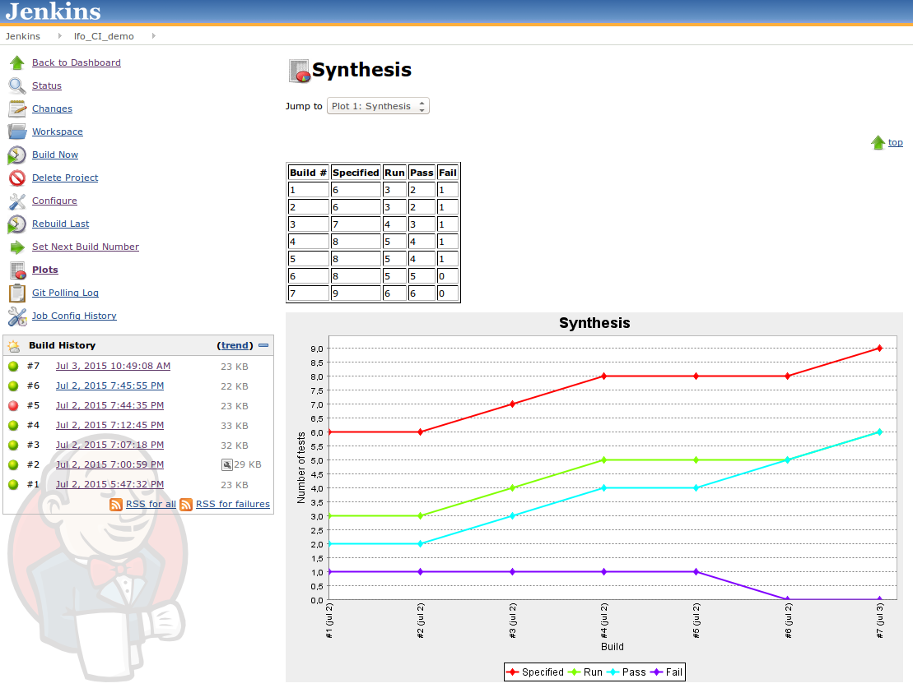

# Jenkins integration

## Setup a job

If you want to try RunTest with jenkins you can configure a job as follow (For Google test framework and Cunit).

### Source Code Management

Git repo:

	https://github.com/lfourestier/Agilitest.git

Branch:

	refs/heads/develop

### Build Triggers

	"Poll SCM" -> H/1 * * * *
	
### Build
 
Execute shell:

	cd Example\Test\Cunit\Build
	make clean all
	cd ..\..\Gtest\Build
	make clean all
	cd ..\..\..\..\Scripts
	@echo Starting RunTest
	python RunTest.py -d ../Example/Test/Cunit,../Example/Test/Gtest -c ../Example/Test/Commands.cfg -r ../Example/Test/TestReport.csv -s ../Example/Test/TestSynthesis.csv
	
### Post-build Actions

**Artifacts:**
 - Example/Test/*.csv
 
**Plot build data:** (Plot plugin required)
 - Data series file: Example/Test/TestSynthesis.csv 
 - Exclude columns by name: Time,Duration
 - "Display original csv above plot"
